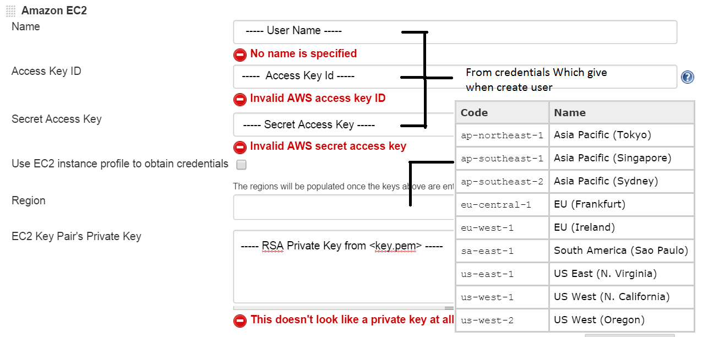
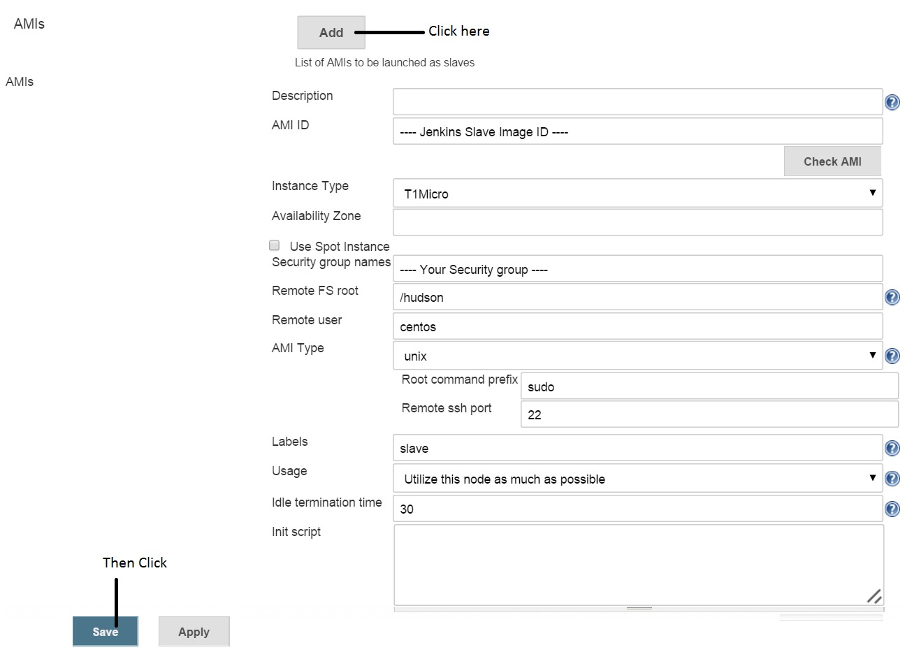

#Setup Jenkins Plugins
###Install Plugins
* Open your browser and navigate to <code>http://< your-jenkins-ip >:8080</code>
* Go to Manage Jenkins --> Manage Plugins
* Then Install
  - Amazon EC2 plugin
  - GIT plugin
  - GitHub plugin
  - Deploy Plugin
  - Robot Framework plugin

###Config Amazon EC2 plugin
* Open Jenkins
* Go to Manage Jenkins --> Configure System
* Click Add a new cloud and select Amazon EC2 on a Cloud section
* Then follow the picture

