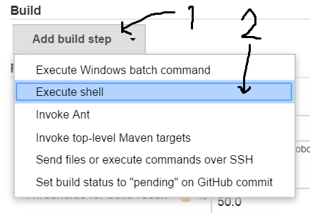
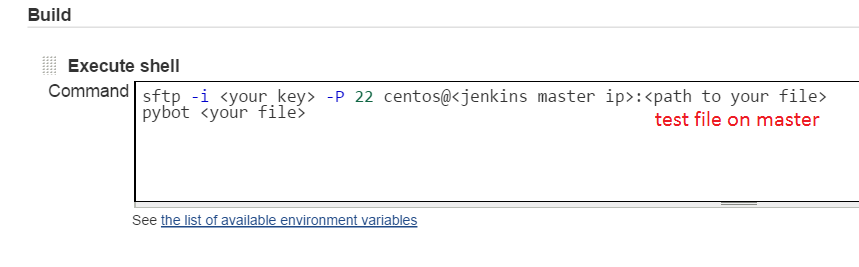

#Setup Git auto pull robot test case

  ###Jenkins Slave Setup  
  1.SSH to slave instance  
  2.put private key file to workspace  

          /hudson/workspace/<job's name>
  3.change private key permission  

        sudo chmod 555 <your key>
  4.Open your browser and navigate to http://< your-jenkins-ip >:8080  
  5.Go to <<x>your job> --> configure  
  6.Follow the picture  
    
  7.Follow the picture  
    
  8.Then save
