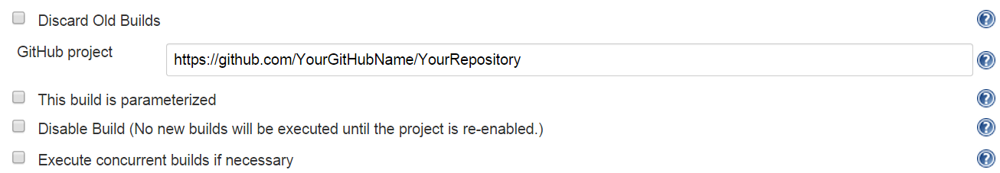
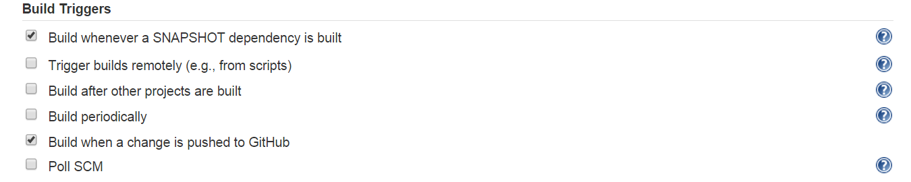
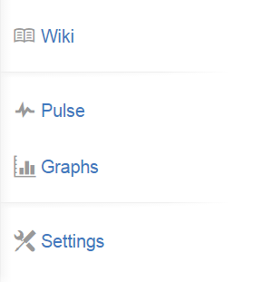
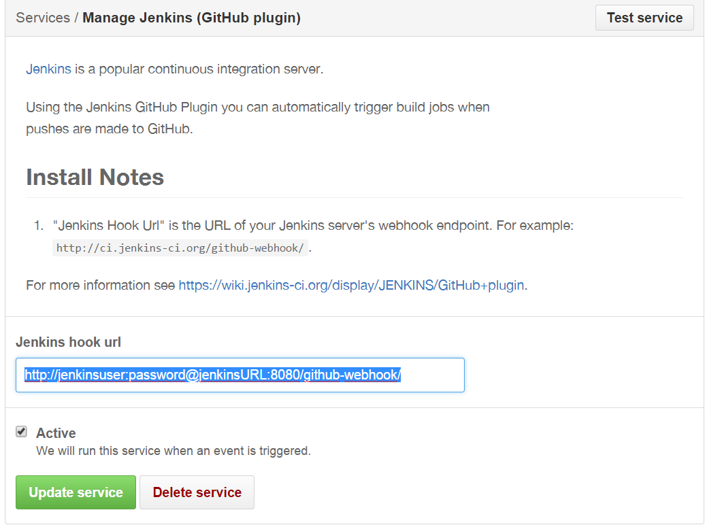
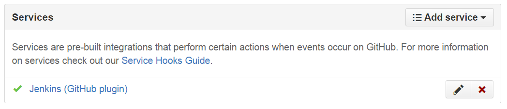

#Auto Build when a change is pushed to GitHub

##Prerequisite
  * Jenkins
  * JDK installed
  * port 8080 enabled

##Installation steps
1.  Open your jenkins, click <code>Manage Jenkins</code>

2.  Click <code>Manage Plugins</code>

3.  Install the following Plugins
      * Git Plugin
      * GitHub Plugin  

4.  Go back to your jenkins dashboard, and navigate to your job's configuration.

5.  Fill in your <code>GitHub project</code> repository URL.

    

6.  Scroll down and make sure <code>Build when a change is pushed to GitHub</code> option is enabled.

    

7.  Next, navigate to your GitHub repository web page, click on <code>Settings</code> at the right side of the screen.

    

8.  Click on <code>Webhooks & Services</code>, Under <code>Services</code>section, Click on <code>Add Service</code> and choose <code>Jenkins (GitHub plugin)</code>

9.  Fill in your Jenkins hook url which normally are <code>http://<kbd>yourjenkinsUsername</kbd>:<kbd>password</kbd>@<kbd>YourJenkinsURL</kbd>:8080/github-webhook</code>  
(don't forget to add the http:// protocol)

10. Click Add Service

11. Navigate to <code>Jenkins (GitHub plugin)</code> and click the <kbd>Edit</kbd> button at the right side.

12. Click on <code>Test Service</code> button and click <kbd>Update Service</kbd>

    

13. If it's working, you should see the green checked icon as shown below.

    
