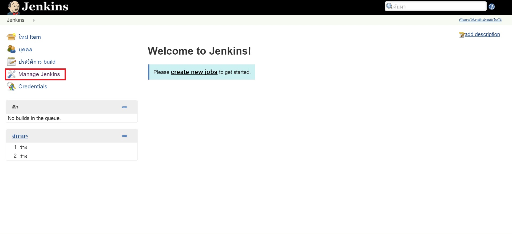
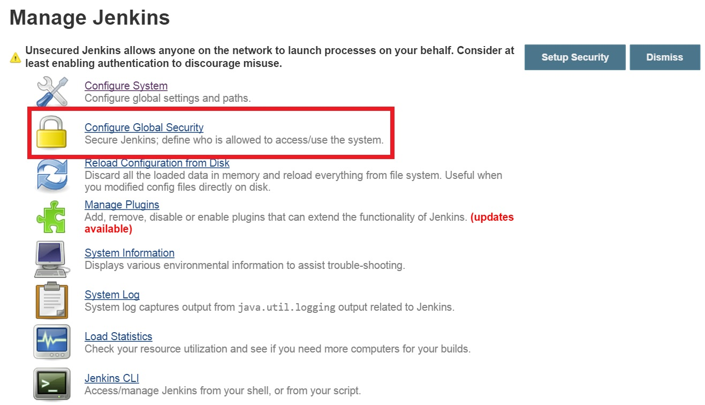
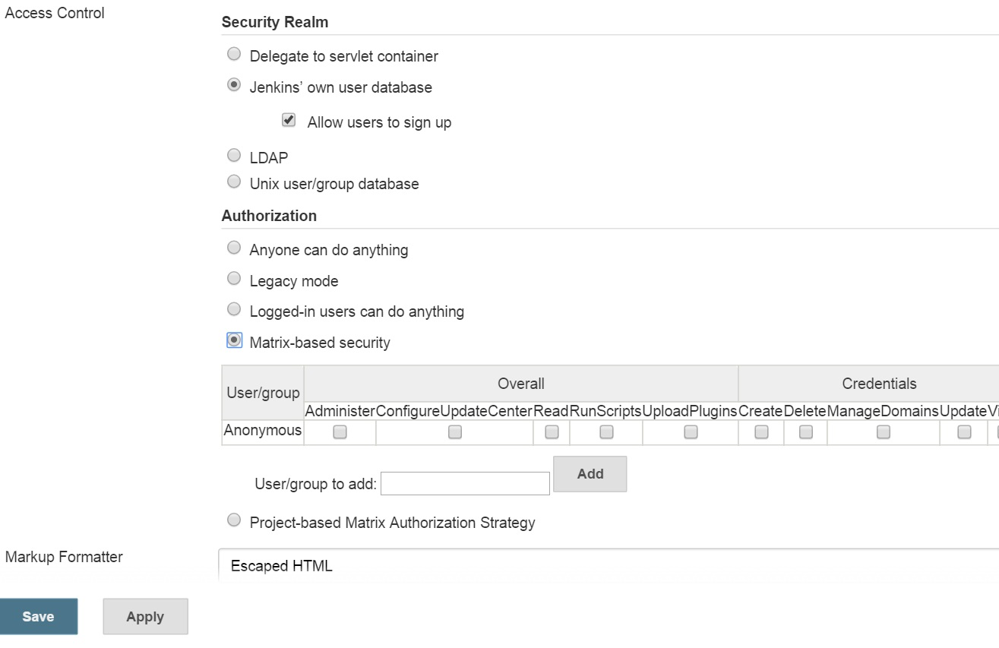
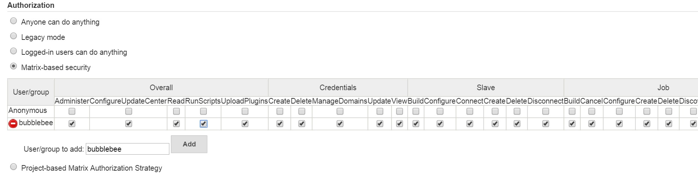
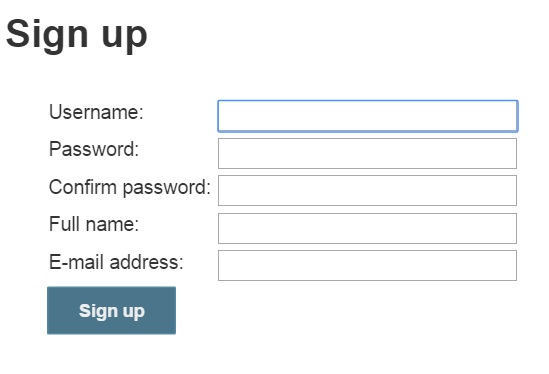

#Securing Jenkins Setup

( Source : http://sanketdangi.com/post/62715793234/install-configure-jenkins-on-amazon-linux )

##Prerequisite
  * Jenkins successfully installed.

##Configuration steps
1.  To enable security for jenkins setup, please select `Manage Jenkins`  

2.  On jenkins dashboard and click on `Configure Global Security`.

3.  After this, please select `Enable Security`.

4.  Select `Jenkins’s Own User Database` under Security realm. Don’t forget to select `Allow users to sign up`. Also, select `Matrix-based security` under Authorization.

5.  Now, please  add an user (for eg., admin) to jenkins user database by adding username under matrix-based security section.

6.  Once done, please provide necessary privileges to this user. In our case, we make this user as an administrator, so he will have full privileges.

7.  Once done, please click on `Save`. Now, you will be asked to provide username and password for the user to login. But we don’t have any. So, please click on `Create an account`.

8.  Now, please provide your username ( “admin” in our case) and provide necessary details like password, name and email address.

9.  Once done, you will be logged into jenkins and your whole setup is secured.
