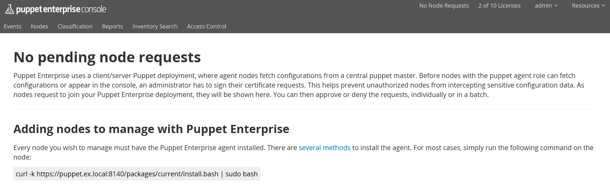
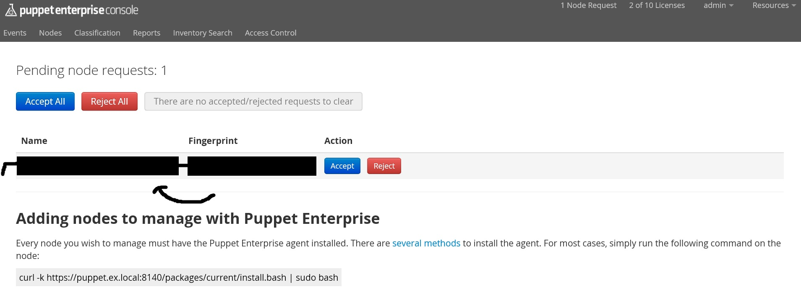

#Puppet Agent Installation for CentOS 7

  

##Prerequisite
  * Puppet Enterprise is successfully installed and running.


##Pre steps
1.  Launch and login to Amazon instance (Agent node)  
2.  Become a root using <code>sudo su -</code> command.  
3.  Edit your <code>hosts</code> file using the following command.  
    
    ```sh
    vi /etc/hosts
    ```
4.  Add your private IP as a hostname for your puppet-master and your puppet-agent in <code>hosts</code> file.  eg.  
  <em>(replace `123.123.123.123`,`123.123.124.100` to your private-ip, `pinocchio.local` to whatever you want.)</em>

   ```sh
   ...
   123.123.123.123 puppet.ex.local puppet
   123.123.124.100 pinocchio.local pinocchio
   ```

5.  Edit your hostname using the following command in Terminal

    ```sh
    hostnamectl set-hostname pinocchio.local
    ```

6.  Restart your network service

   ```sh
   service network restart
   ```

7.  Make sure your hostname is correct by execute the follwing command in Terminal

   ```sh
   hostname
   ```
    Here's a reminder of what the output should contain :

   ```sh
   pinocchio.local
   ```

##Puppet Agent Installation steps
1.  Open Web-Browser and login to your `Puppet-Master Console`  

2.  Click on `No Node Requests` at the top of the screen.


3.  You should be redirected to `Console` with `No pending node requests`

  In order to add agent nodes to Puppet Master, you need to execute the command under `Adding nodes to manage with Puppet Enterprise` section in your agent node.

   ```sh
   curl -k https://puppet.ex.local:8140/packages/current/install.bash | sudo bash
   ```

4.  Wait until the installation is completed, refresh the browser, you should notice the `1 Node Request`, click on it.


5.  You should see the pending node requests, accept it.


6.  Now that Puppet agent is installed to your master and ready to run. it's time to create a [Puppet configuration](puppet-configuration.md).
