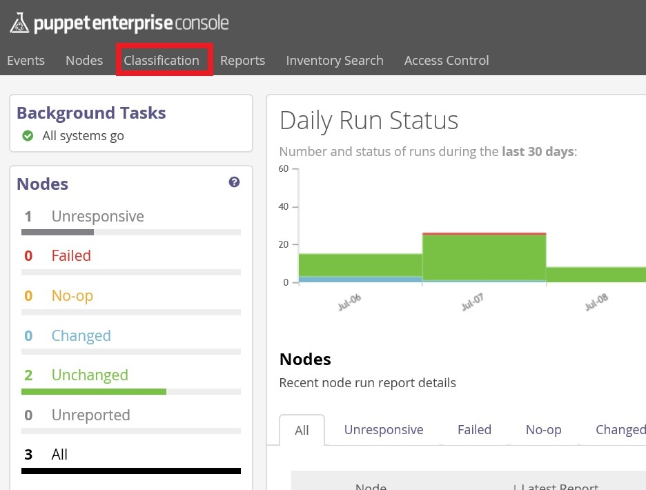
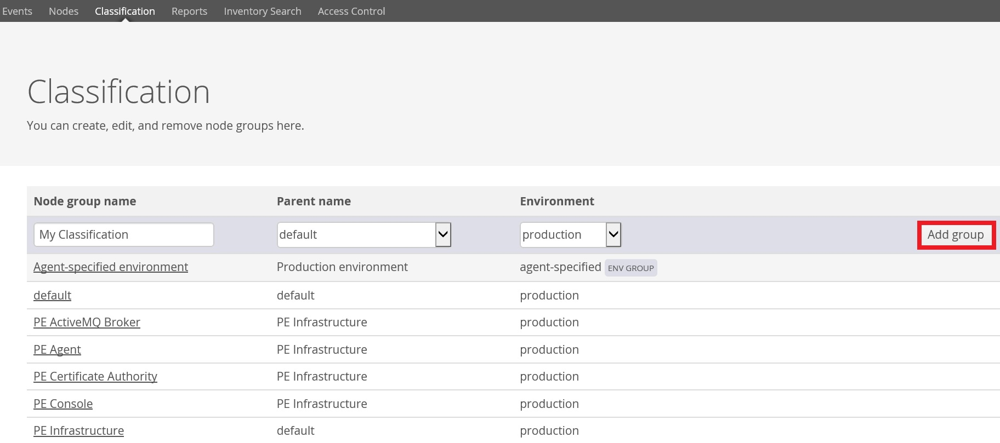
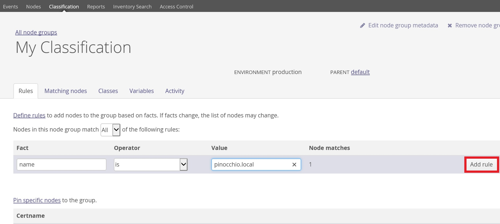
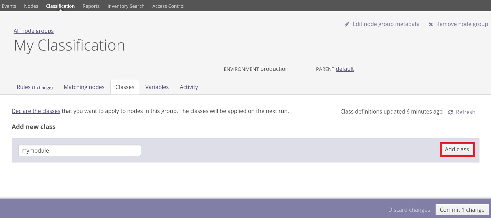
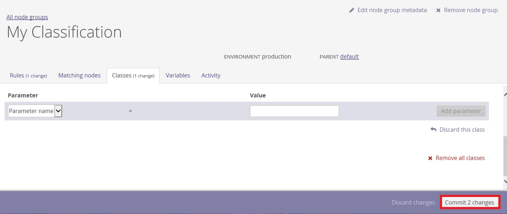

#Puppet Configuration Creation Guide

  

##Prerequisite
  * Puppet Enterprise is successfully installed and running.
  * Puppet Agent is successfully connnected to Puppet Master

##Puppet Master - Create a Configuration file
1.  Remote and login to Amazon instance (`Master`)
2.  Become a root using <code>sudo su -</code> command.
3.  Change directory to <code>puppet/modules</code> using the following command.

          cd /etc/puppet/modules

4.  Now generate a new module by executing the following command in Terminal.  
 <em>You will need to substitute your own module name for `ultron-mymodule`. </em>

          puppet module generate ultron-mymodule

5.  You should notice that `ultron-mymodule` folder is created, you should rename the folder to match its class name by invoke the following command.

          mv ultron-mymodule mymodule

    Then, relocate to that folder`/manifests`.

          cd mymodule/manifests

6.  You should see the configuration file named `init.pp`, open it with your editor.

          vi init.pp

7.  Now, replace `class mymodule {  }` with the following example configuration.


  ```ruby
  class mymodule {
    file { '/root/example_file.txt':
      ensure => "file",
      owner  => "root",
      group  => "root",
      mode   => "700",
      content => "Congratulations!
      Puppet has created this file.
    ",}
  }
  ```

  Inside the class construct is an instruction to configure a particular file called `/root/example_file.txt`. The file construct instructs Puppet to ensure that there is a file at that name, that the file is a file and not a directory, that it has the specified ownership, that it has the specified protection mode, and that it has the specified content.


##Add Puppet Agent to Module
(<em>Visit [PuppetLabs Docs](https://docs.puppetlabs.com/pe/latest/console_classes_groups.html) for more information.</em>)

1.  Open Web-Browser and login to your `Puppet-Master Console`.  

2.  Click on `Classification` tab at the top of the screen.

3.  Specify `Node group name` and other fields as you want, then click <kbd>Add group</kbd>.

4.  Click on the `Classification Group` you previously added.

5.  Fill in your rules for the puppet agent to be added in this classification. For this tutorial, we'll use node name. Click <kbd>Add rule</kbd>. 

6.  Click on `Classes` Tab, under `Add new class` section, specify your `Class name` and click <kbd>Add class</kbd>.

7.  At the bottom if the screen, click on <kbd>Commit 2 changes</kbd> to save you settings.

8.  Now, your agent node would be ready to be invoked.

##Puppet Agent - Invoke Puppet
1.  Now that you have installed Puppet and created a configuration file, you can invoke Puppet by logging into your puppet agent and invoke the following command.

        sudo puppet agent -t

2.  Puppet should create the file `/root/example_file.txt` owned by root, in the root group, and with `-rwx------` permissions. Check this with:

        ls -la /root

    Check the contents of the file with:

        cat /root/example_file.txt

    You should see the text we specified in the configuration file.

3.  Damage The File And Invoke Puppet Again  
    <em>by editing/removing the file and invoke `sudo puppet agent -t` </em>

    It should repair the file to what we specified in puppet master.

###Optional - Puppet Agent Interval Configuration
  In your puppet agent, relocate to `/etc/puppetlabs/puppet`

          cd /etc/puppetlabs/puppet

  Edit the configuration file by

          vi puppet.conf

  Add the following line inside `[main]` section.

```ruby
  [main]
  ...
  runinterval = 10

  ...
  ```

  This will update the puppet agent every 10 seconds  
  <em>For more information about `runinterval` see [Configuration Reference](https://docs.puppetlabs.com/references/latest/configuration.html#runinterval)
  </em>

  Then, try to damage the file, wait for 10s, it should repair the file to its configured state.


  <em>
  Source : https://www.digitalocean.com/community/tutorials/how-to-install-puppet-in-standalone-mode-on-centos-7
  </em>
